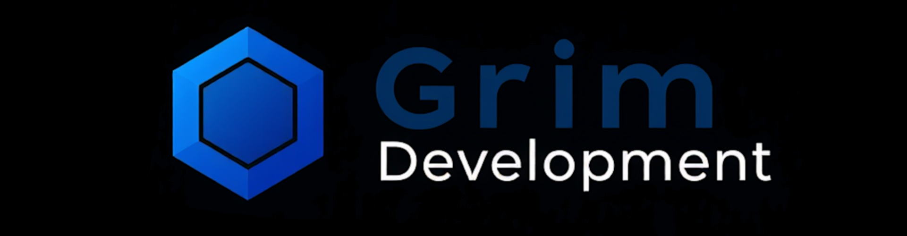

## 🔮 Welcome to My Digital Playground

GrimDevelopment is my personal sandbox of technological experimentation. This is where random ideas become code, where curiosity meets creation, and where no project is too weird or too wild.

## 🧪 What is This?

Think of this organization as my digital workshop - a collection of projects that sparked my interest at any given moment. Some might be practical, some might be purely experimental, but all are born from pure creative impulse.

## 🧩 Philosophy

> "Code is art. Projects are spontaneous creations of curiosity."
> Every project here is:

-   🌈 Driven by pure curiosity
-   🔬 An exploration of new technologies
-   🚧 Potentially unfinished, always evolving
-   🧠 A reflection of current interests and learning journeys

## 🚦 Current Mood:

_Randomly generating project ideas..._

## 🌟 Expect the Unexpected

Projects might include:

-   Random utility scripts
-   Experimental algorithms
-   Learning projects
-   Tech demos
-   Solve-for-fun challenges
    **No consistent theme. No rigid roadmap. Just pure coding exploration.**

## 🤝 Collaboration

Interested in my chaotic coding journey?

-   👀 Feel free to explore
-   💡 Suggestions welcome
-   🚀 Contributions always appreciated

## 🌐 Connect

-   🐦 [Twitter](https://x.com/0x7C2f)
-   📧 [Email](mailto:contact@grimdevelopment.com)

---

**Turning random ideas into code, one commit at a time** 🖤🔥
