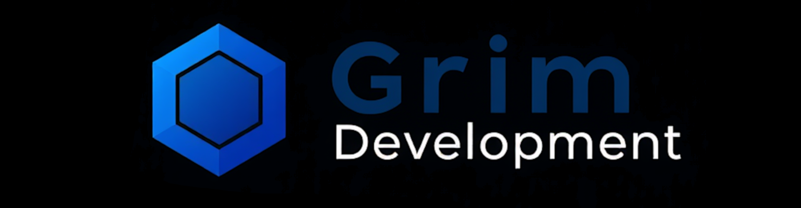

<!-- ────────────────────────────── -->
<!--   🏴‍☠️ GRIM DEVELOPMENT ZONE   -->
<!-- ────────────────────────────── -->

<p align="center">
  
</p>

<h1 align="center">GRIM DEVELOPMENT</h1>
<p align="center"><i>“Turning randomness into architecture.”</i></p>

---

<div align="center">

[](https://github.com/GrimDevelopment)
[](https://github.com/0x7C2f)
[](#)
[](#)

</div>

---

## 🧪 Welcome to the Chaos

This isn’t a portfolio.  
It’s a **living archive of experiments** — half-built systems, side quests, and reckless prototypes.  
Every repo here exists because curiosity demanded it.

> _"Code is the sketchbook of thought."_  
> — Anonymous developer, probably after 3 AM

---

## 🧩 Ethos

**No deadlines. No rules. No corporate polish.**  
Only discovery through doing.

| Principle | Description |
|------------|-------------|
| 🧠 Curiosity First | Projects start as “what ifs.” |
| ⚙️ Evolving | Nothing is final — everything mutates. |
| 🔮 Experimental | Break it to understand it. |
| 🪄 Artistic Logic | Code as creative medium, not constraint. |

---

## 🔭 Areas of Interest

- 🧬 **AI Systems & MCP Frameworks** — Autonomous reasoning pipelines and context-aware agents  
- 🧩 **MMORPG Mechanics** — Language-learning games and ECS-based worlds  
- 🧰 **DevOps Experimentation** — Cloud tunnels, container orchestration, infrastructure minimalism  
- 🕹️ **Front-End Oddities** — PixiJS, Livewire, Filament, Tailwind visual experiments  
- 💾 **Data Craft** — Vectors, embeddings, token logic, prompt memory systems  

---

## 🚦 Current Mood

```text
> git commit -m "spawn chaos entity v0.3.7"
> pushing to main...
> reality forked successfully.
````

---

## 🌈 Project Spectrum

| Type               | Example                                  |
| ------------------ | ---------------------------------------- |
| 🧠 AI & Automation | Autonomous dev tools, task orchestration |
| 🕹️ Interactive    | Game-like language learning modules      |
| 🧮 Utilities       | Random scripts that somehow work         |
| 🔧 Experiments     | Abandoned ideas that taught something    |

---

## 🧨 Signature Style

* Repository names inspired by **concepts**, not conventions.
* Documentation styled like **field reports**, not manuals.
* Code comments read like **cryptic notes from future me**.

---

## 🤝 Join the Madness

* Fork, remix, or reimagine anything.
* PRs are welcome — but understand: chaos is a feature, not a bug.
* Collaboration ≠ conformity.

<div align="center">

🕸️ [Website](https://grimdevelopment.com)
🐦 [Twitter](https://x.com/0x7C2f)
📧 [Email](mailto:contact@grimdevelopment.com)
💀 [Owner: 0x7C2f](https://github.com/0x7C2f)

</div>

---

<p align="center">
  
</p>

<p align="center">
  <sub>Built with caffeine, chaos, and command-line sorcery</sub>
</p>
